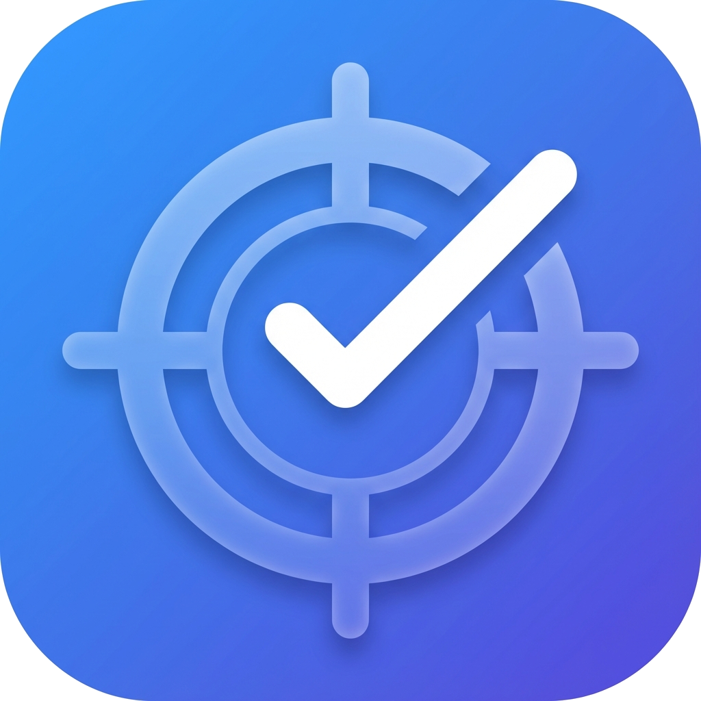

<div align="center">

<a href="https://mindwtr.app"></a>

# Mindwtr

**Get everything out of your head.**

A free to-do app built on Getting Things Done (GTD). Works offline, no account needed.

20,000+ users · Windows · macOS · Linux · iOS · Android

[**Download**](https://mindwtr.app/#download) · [Features](#highlights) · [Docs](https://docs.mindwtr.app/) · [中文](./README_zh.md)

[](https://github.com/dongdongbh/Mindwtr/actions/workflows/ci.yml)
[](LICENSE)
[](https://github.com/dongdongbh/Mindwtr/releases)
[](https://discord.gg/gc4h5t58PR)
[](https://github.com/sponsors/dongdongbh)
[](https://ko-fi.com/D1D01T20WK)

<p align="center" style="text-align: center;">
  <a href="https://apps.microsoft.com/detail/9n0v5b0b6frx?ocid=webpdpshare" target="_blank">
    
  </a>
  <a href="https://play.google.com/store/apps/details?id=tech.dongdongbh.mindwtr" target="_blank">
    
  </a>
  <a href="https://apps.apple.com/app/mindwtr/id6758597144" target="_blank">
    
  </a>
  <a href="https://flathub.org/apps/tech.dongdongbh.mindwtr" target="_blank">
    
  </a>
  <a href="https://apt.izzysoft.de/packages/tech.dongdongbh.mindwtr" target="_blank">
    
  </a>
  <a href="https://f-droid.org/en/packages/tech.dongdongbh.mindwtr/" target="_blank">
    
  </a>
  <a href="https://snapcraft.io/mindwtr" target="_blank">
    
  </a>
</p>

</div>

<div align="center">
  <video src="https://github.com/user-attachments/assets/3682cee5-06fb-40cf-993c-0be383fa6ba5" controls playsinline width="900" aria-label="Try Mindwtr"></video>
  <p><i>Capture, organize, and focus on desktop &amp; mobile</i></p>
</div>

## How it works

Start with whatever is on your mind, from "plan Mom's birthday" to "learn guitar someday." Mindwtr guides you through what to do with it. You don't need to learn GTD first.

1. **Capture it.** Send tasks and ideas to your Inbox with a desktop shortcut, phone widget, or share sheet.
2. **Choose a next step.** Break a bigger plan into actions, track promises in Waiting For, and keep future ideas in Someday/Maybe.
3. **Pick something to do.** Open Focus for today's schedule and your next actions. Filter by where you are or the tools you have with you.
4. **Review each week.** Follow the guided review to check your projects, follow up on waiting items, and catch loose ends.

<p align="center">
  <video src="https://github.com/user-attachments/assets/1c685f99-87a5-44c1-9fdd-d228a66de67c" controls playsinline width="900" aria-label="GTD in Mindwtr"></video>
</p>

[All videos on the website](https://docs.mindwtr.app/start/videos) · [YouTube channel](https://www.youtube.com/@mindwtr)

For more about the method, read [GTD in 15 minutes](https://hamberg.no/gtd) or [explore the interactive GTD flowchart](https://docs.mindwtr.app/assets/diagrams/gtd-workflow).

## Highlights

- **GTD from capture to review.** Work through your Inbox, plan projects, and follow a guided weekly review to keep both your next steps and longer-term plans in view.
- **Your data stays yours.** Keep tasks on your device, work offline, and export a backup. Sync is optional: choose [iCloud, Dropbox, a shared folder, WebDAV, or your own server](https://docs.mindwtr.app/data-sync/).
- **The same workflow on your phone and computer.** Use the full GTD workflow on Windows, macOS, Linux, iPhone, iPad, and Android, with 20 language options.
- **Bring your existing tasks.** [Import from Todoist, TickTick, OmniFocus, and more](https://docs.mindwtr.app/import/) so you can start with the plans you've already made.
- **Add the tools you need.** Plan with a calendar, set up recurring tasks, and keep notes and attachments with your work. AI assistance is off by default and yours to enable.

The name Mindwtr comes from *mind like water*: write down what’s on your mind so you can give your attention to the task at hand.

Mindwtr is built for your personal tasks. Start with a simple list and use more options as you need them. There are no streaks or productivity scores to keep up with.

[**Explore all features →**](https://mindwtr.app/features)

## Why Mindwtr (Quick Comparison)

Mindwtr is for people who want the full GTD method in one app, with data they own and no lock-in. Here is how it compares with a few other to-do apps.

| Capability                                                              | Mindwtr | Todoist | TickTick | Everdo | NirvanaHQ |
| ----------------------------------------------------------------------- | ------- | ------- | -------- | ------ | --------- |
| Open source                                                             | ✅      | ❌      | ❌       | ❌     | ❌        |
| Follows the full GTD method out of the box                              | ✅      | ⚠️      | ⚠️       | ✅     | ✅        |
| Works everywhere: Windows, Mac, Linux, iPhone, Android, web             | ✅      | ✅      | ✅       | ⚠️     | ⚠️        |
| Wearable support (smartwatches or smart rings)                         | ✅      | ✅      | ✅       | ❌     | ❌        |
| Works offline, no account needed                                        | ✅      | ❌      | ❌       | ✅     | ❌        |
| Optional AI helper (your own AI account, or one on your computer)       | ✅      | ❌      | ❌       | ❌     | ❌        |
| You pick where your data syncs (Dropbox, your server, a folder, WebDAV) | ✅      | ❌      | ❌       | ⚠️     | ❌        |
| Completely free                                                         | ✅      | ❌      | ❌       | ❌     | ❌        |

Legend: `✅` = yes, `❌` = no, `⚠️` = partial/limited support.

_This comparison is based on the current public capabilities of each product. If any entry is outdated, feel free to open an issue or PR with sources._

[Full comparison and sources →](https://mindwtr.app/compare)

## Installation

For the complete and current install guides, see [Desktop Installation](https://docs.mindwtr.app/start/desktop-installation) and [Mobile Installation](https://docs.mindwtr.app/start/mobile-installation).

Quick options:

- Windows: Microsoft Store, Winget, Chocolatey, Scoop, or GitHub Releases.
- macOS: Mac App Store, Homebrew, TestFlight beta, or GitHub Releases.
- Linux: Flathub, Snap, AUR, APT/RPM repos, or GitHub Releases.
- Android: Google Play, F-Droid, IzzyOnDroid, or GitHub Releases APK.
- iOS: App Store or TestFlight beta.
- Web / self-hosted: [Cloud Deployment](https://docs.mindwtr.app/data-sync/cloud-deployment) or the [Docker guide](docker/README.md).

Windows builds: free code signing provided by [SignPath.io](https://signpath.io/), certificate by [SignPath Foundation](https://signpath.org/) — application approved, certificate pending issuance. See the [code signing policy](https://mindwtr.app/signing).

<details>
<summary>Package manager quick commands</summary>

```bash
flatpak install flathub tech.dongdongbh.mindwtr
yay -S mindwtr-bin
brew install --cask mindwtr
```

```powershell
winget install dongdongbh.Mindwtr
```

For APT/RPM repo setup, source builds, portable ZIPs, mobile store variants, and Docker setup, use the full install guides above.

</details>

## Developers & automation

Want to connect other tools? Explore the [local API](https://docs.mindwtr.app/power-users/local-api), the [MCP server](https://docs.mindwtr.app/power-users/mcp), or [host the web app and sync server yourself](https://docs.mindwtr.app/data-sync/cloud-deployment). These are optional.

[](https://mcptoplist.com/server/io.github.dongdongbh%2Fmindwtr)

## Community

Mindwtr is shaped by its users and contributors. Thank you for helping improve it.

### :hearts: Contributing & Support

If you want to get involved for coding, start with [CONTRIBUTING.md](docs/CONTRIBUTING.md).

You can help in several ways:

1. **Spread the word:** Share Mindwtr with friends and communities, and support it on [Product Hunt](https://www.producthunt.com/products/mindwtr) and [AlternativeTo](https://alternativeto.net/software/mindwtr/).
2. **Leave store reviews:** A good rating/review on the [App Store](https://apps.apple.com/app/mindwtr/id6758597144), [Google Play](https://play.google.com/store/apps/details?id=tech.dongdongbh.mindwtr), or [Microsoft Store](https://apps.microsoft.com/detail/9n0v5b0b6frx?ocid=webpdpshare) helps a lot.
3. **Star and share:** Star ⭐ the repo and post about Mindwtr on [X](https://twitter.com/intent/tweet?text=I%20like%20Mindwtr%20https%3A%2F%2Fgithub.com%2Fdongdongbh%2FMindwtr), [Reddit](https://www.reddit.com/submit?url=https%3A%2F%2Fgithub.com%2Fdongdongbh%2FMindwtr&title=I%20like%20Mindwtr), or [LinkedIn](https://www.linkedin.com/shareArticle?mini=true&url=https%3A%2F%2Fgithub.com%2Fdongdongbh%2FMindwtr&title=I%20like%20Mindwtr).
4. **Report bugs and request features:** Open issues on [GitHub Issues](https://github.com/dongdongbh/Mindwtr/issues).
5. **Join the community chat:** Come to [Discord](https://discord.gg/gc4h5t58PR).
6. **Help with translations:** Contribute locale updates in [`packages/core/src/i18n/locales/`](packages/core/src/i18n/locales/).
7. **Contribute code/docs:** Open a pull request and follow the [contribution guide](docs/CONTRIBUTING.md) and commit conventions.
8. **Pick and build:** Community members are welcome to pick any open issue and submit a PR.
9. **Sponsor the project:** Support ongoing development via [GitHub Sponsors](https://github.com/sponsors/dongdongbh) or [Ko-fi](https://ko-fi.com/D1D01T20WK).

## Star History

<a href="https://www.star-history.com/?repos=dongdongbh%2FMindwtr&type=date&legend=top-left">
 <picture>
   <source media="(prefers-color-scheme: dark)" srcset="https://api.star-history.com/chart?repos=dongdongbh/Mindwtr&type=date&theme=dark&legend=top-left&sealed_token=FEttB-7Usxl2vOdPE6oWOyGuWDgtvmBXqdm8XO1JLHtvdji48vvbX3VAbe-G2M9IM90c_1UQwn39SrfxZB0n8vLkP7f9GWn_5K1veBdx4ka7HvnXOAYnlK-Td8KI9HVjBVQeMHMcFRhIKjL5y0knWi4BBhdfqUPCSvtWExdJ9cXo4UlRaLaoW12OxQqk" />
   <source media="(prefers-color-scheme: light)" srcset="https://api.star-history.com/chart?repos=dongdongbh/Mindwtr&type=date&legend=top-left&sealed_token=FEttB-7Usxl2vOdPE6oWOyGuWDgtvmBXqdm8XO1JLHtvdji48vvbX3VAbe-G2M9IM90c_1UQwn39SrfxZB0n8vLkP7f9GWn_5K1veBdx4ka7HvnXOAYnlK-Td8KI9HVjBVQeMHMcFRhIKjL5y0knWi4BBhdfqUPCSvtWExdJ9cXo4UlRaLaoW12OxQqk" />
   
 </picture>
</a>

## Sponsors

Thanks to these monthly sponsors for supporting Mindwtr. Companies interested in sponsoring Mindwtr — README/website placement or partnerships — see [SPONSORS.md](SPONSORS.md).

<p align="center">
  <a href="https://github.com/jarrydstan" title="@jarrydstan">
    
  </a>
  <a href="https://github.com/ronmolenda" title="@ronmolenda">
    
  </a>
  <a href="https://github.com/karl1990" title="@karl1990">
    
  </a>
  <a href="https://github.com/srijan" title="@srijan">
    
  </a>
  <a href="https://github.com/davibicudo" title="@davibicudo">
    
  </a>
  <a href="https://github.com/PLPeeters" title="@PLPeeters">
    
  </a>
  <a href="https://github.com/danhs" title="@danhs">
    
  </a>
  <a href="https://github.com/NikoScotch" title="@NikoScotch">
    
  </a>
  <a href="https://github.com/nicopico-dev" title="@nicopico-dev">
    
  </a>
  <a href="https://github.com/Hillside502" title="@Hillside502">
    
  </a>
  <a href="https://github.com/alxgda" title="@alxgda">
    
  </a>
  <a href="https://github.com/nomisterling" title="@nomisterling">
    
  </a>
</p>

<p align="center">
  <sub><a href="https://github.com/jarrydstan">@jarrydstan</a> · <a href="https://github.com/ronmolenda">@ronmolenda</a> · <a href="https://github.com/karl1990">@karl1990</a> · <a href="https://github.com/srijan">@srijan</a> · <a href="https://github.com/davibicudo">@davibicudo</a> · <a href="https://github.com/PLPeeters">@PLPeeters</a> · <a href="https://github.com/danhs">@danhs</a> · <a href="https://github.com/NikoScotch">@NikoScotch</a> · <a href="https://github.com/nicopico-dev">@nicopico-dev</a> · <a href="https://github.com/Hillside502">@Hillside502</a> · <a href="https://github.com/alxgda">@alxgda</a> · <a href="https://github.com/nomisterling">@nomisterling</a></sub>
</p>

---

<p align="center">
  <sub>Mindwtr™ and the Mindwtr logo are trademarks of the Mindwtr project. Official website: <a href="https://mindwtr.app">mindwtr.app</a></sub>
</p>
